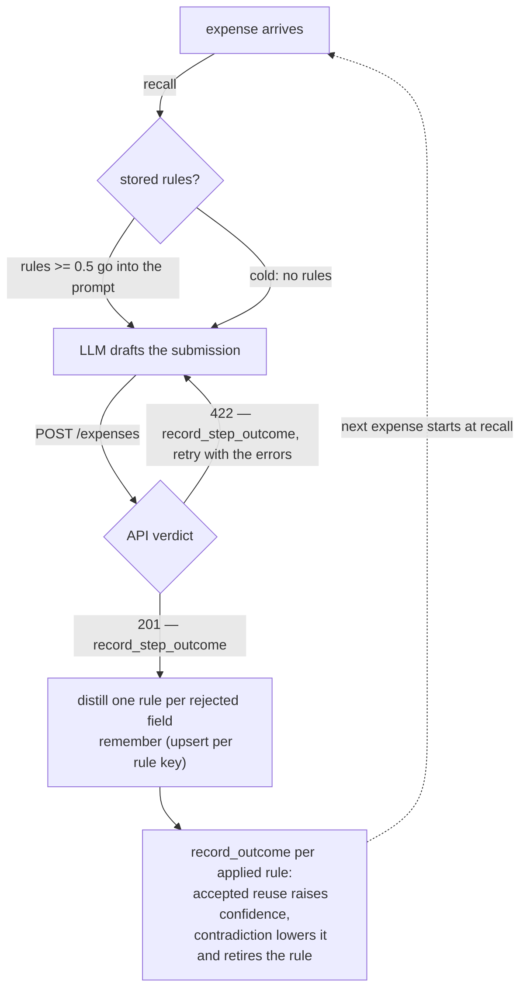

# Mubit feedback-loop demo

The Mubit learning loop in its smallest runnable form. One agent, one
task type, one terminal. No UI.

An agent submits expense reports to an internal API. Nobody gave it the
API's validation rules. The API teaches by rejection; the agent stores
what it learns in Mubit; the next submission starts from what memory
holds. The transcript prints every piece of data that moves:

- `->` lines show data going into Mubit or the API
- `<-` lines show data coming back

## Run

```bash
cp .env.example .env    # fill in MUBIT_ENDPOINT, MUBIT_API_KEY, OPENAI_API_KEY
python3 -m venv .venv && .venv/bin/pip install -r requirements.txt
./run_demo.sh           # three scripted acts
./run_demo.sh --step    # pause between acts
./run_demo.sh --chat    # scripted acts, then type your own expenses
./run_demo.sh --fresh-chat   # chat only, cold memory
```

Each run uses a fresh Mubit run id, so each run starts with empty
memory and learns from zero. The model is `gpt-5-mini` (override with
`MODEL=`).

## Chat UI — the support scenario

```bash
./run_ui.sh    # http://127.0.0.1:7874
```

A browser demo of the same loop on a customer-support scenario
(`server.py` + `ui.html` + `support.py`). Click **Run tickets**:
scripted customers arrive in the chat window one ticket at a time and
the agent works each one live. Left: the conversation, with the agent's
activity (recall, tool calls, escalations, stored lessons) inside each
reply bubble. Right: the lesson board with its confidence band, and a
feed of every Mubit SDK call — method, latency, one-line summary; a row
expands to the full request and response JSON. The composer stays live,
so you can type your own customer message at any point.

The products are fictional, so the model cannot know their facts. The
agent learns only from verifiable events:

- the helpdesk backend's deterministic verdicts (refund accepted or
  denied under the active policy version)
- tier-2 escalation notes — the scripted answer a senior agent sends
  back when the agent decides to escalate
- scripted customer follow-ups with deterministic triggers (a refund
  that policy allows was not issued; a reply is missing the known
  answer)

Three ticket datasets ship with the demo (header dropdown; switching
starts a fresh run with empty memory): Orbit (SaaS support), Maple &
Twine (e-commerce), and Orbit day two (same product, new customers,
steeper curve). Each is sequenced for a learning curve:

1. **Cold.** The first ticket of each kind ends in an escalation or a
   denied refund; the verified outcome is distilled and stored as a
   lesson.
2. **Warm.** The same question from a new customer is answered
   first-touch from the recalled lesson. Each reuse is reported back
   through `record_outcome` and confidence climbs.
3. **Policy change.** The vendor widens the refund window and nobody
   tells support. The stored lesson now gives wrong answers; a customer
   dispute triggers a re-check against the billing system, the verified
   result contradicts the lesson, and the lesson is retired and
   replaced. The replacement wins the next ticket first-touch.

A run plays 10 tickets in a few minutes. Header controls: the policy
switch (the same change the run script makes), Reflect (server-side
distillation over the recorded outcomes), and New run (fresh run id,
empty memory).

## Two integration styles

The support scenario ships in two versions that share the datasets, the
backend, and the support agent:

```bash
./run_ui.sh          # v1 — harness-managed memory, http://127.0.0.1:7874
./run_ui_agent.sh    # v2 — a memory agent,        http://127.0.0.1:7875
```

**v1 (`server.py` + `support.py`).** The application code decides when
to call Mubit: recall at ticket start, store after the close, outcomes
per applied lesson. Deterministic and minimal — the integration is a
handful of fixed call sites.

**v2 (`server_agent.py` + `agentic.py`).** A second LLM agent owns the
memory. At ticket start it decides what to recall — it writes its own
queries — and briefs the support agent; at ticket close it reads the
verified events and decides what to store, which lessons to reinforce
or fail, and what to retire. Its briefing and debrief appear as cards
in the chat, and every Mubit call in the side pane is one of its
decisions. The harness only validates its tool calls (known lesson ids,
key format, caps). Same loop, same data in and out — the difference is
who decides.

## The three acts

1. **Cold start.** No stored rules. The first submission collects a
   stack of field errors; the retry passes; the agent distills one rule
   per rejected field and stores each as a lesson.
2. **Warm.** New expenses, same API. Stored rules go into every prompt.
   Submissions pass on the first try, and each accepted reuse is
   reported back to the lessons it used — confidence climbs.
3. **The API changes.** The service switches its date format and nobody
   tells the agent. The stored date rule gets contradicted: its
   confidence takes a real hit, the agent stops applying it inside the
   task, retires it once the corrected submission is accepted, and the
   replacement rule re-earns trust from the initial value.

## The loop



## What goes in, what comes out

| Call | In | Out |
| --- | --- | --- |
| `recall` | a query, `entry_types=["lesson"]` | stored rules with `confidence` (in `metadata_json`) |
| `record_step_outcome` | one outcome per submission attempt: step id, success/failure, signal, rationale | acknowledgement; feeds server-side reflection |
| `remember` | the distilled rule as a lesson, `upsert_key=rule:<field>` | acknowledgement; the text recall returns next time |
| `record_outcome` | the lesson id, outcome, a **signed** signal | `updated_confidence`, `reinforcement_count` |
| `delete_lesson` | run id + lesson id of a contradicted rule | removal; the replacement takes the key |
| `reflect` | a window over recent activity | lessons the server distilled from the recorded outcomes |

## The confidence band

A lesson starts at 0.5. Each `record_outcome` moves it:
`confidence += signal * 0.1`, clamped to [0, 1], and the reinforcement
count steps up or down with the signal's sign.

| Band | Range | Effect |
| --- | --- | --- |
| high — trusted | >= 0.75 | applied in every prompt |
| medium — applied | >= 0.5 | applied in every prompt |
| low — quarantined | < 0.5 | kept in memory, not applied |

The band is not a display value: the recall gate reads it. A rule the
API contradicts takes a negative signal immediately, is dropped for the
rest of that task, and is retired and replaced once the corrected
submission is accepted. The replacement starts back at 0.5 and earns
its way up.

## What keeps the demo honest

- The pass/fail verdict is the API validator's accept or reject —
  deterministic code in `expense_api.py`, not a score over the agent's
  text.
- The agent never reads `expense_api.py`. It sees only the responses
  `submit()` returns.
- The stored rules are written by the agent's own LLM from the error
  messages it received. Nothing is seeded.
- Act 2's first-try acceptances depend on the stored rules alone; the
  cold attempt in act 1 shows what the same model does without them.

`sample_run.txt` is one full captured run.
